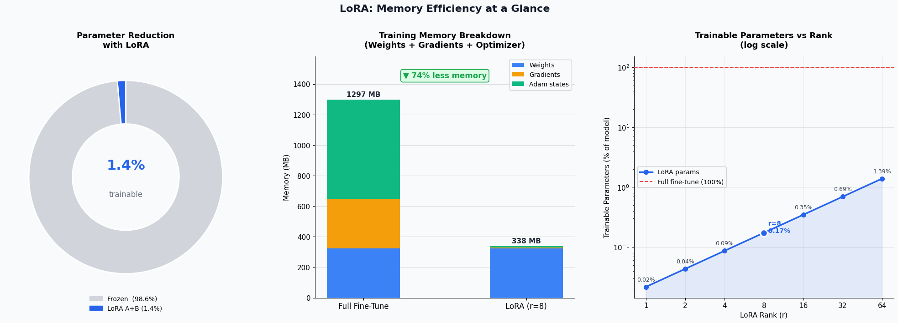
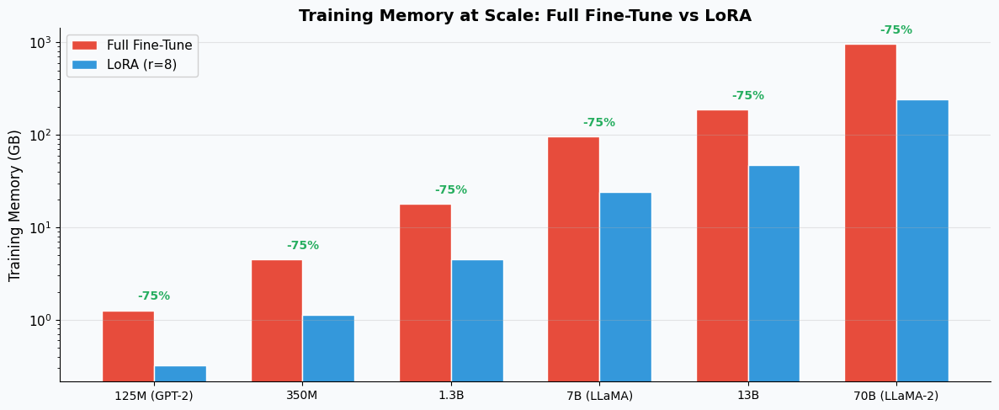

# LoRA from Scratch — Raw PyTorch, No Wrappers

Implementing Low-Rank Adaptation without HuggingFace PEFT to understand the tensor mechanics that actually drive memory savings.

---

## The Problem

Full fine-tuning a 6-layer transformer with `d_model=768` means updating 43.3 million parameters. Every one of those parameters needs a gradient tensor, and Adam needs two more states (momentum and variance) per parameter. That pushes training memory to ~660 MB just for this toy model — and scales to 960 GB for LLaMA-2 70B. Most teams can't afford that. LoRA solves it by freezing the entire pretrained model and learning a tiny correction through two small matrices. A rank-8 LoRA adapter on the same model trains only 147K parameters — 0.34% of the original — and cuts training memory by 75%.

## How It Works

Instead of updating $W$ directly, LoRA learns a low-rank correction:

$$\Delta W = B \times A$$

Where $A \in \mathbb{R}^{r \times d_{in}}$ and $B \in \mathbb{R}^{d_{out} \times r}$, with $r \ll d_{in}$. The forward pass becomes:

$$y = Wx + \frac{\alpha}{r} \cdot BAx$$

$W$ stays frozen. Only $A$ and $B$ receive gradients.

For a 768×768 weight matrix (589,824 params), a rank-8 LoRA adds just 12,288 trainable parameters — a 48x reduction per layer.

## Memory Comparison (Measured, Not Estimated)

6-layer MiniTransformer, `d_model=768`, LoRA applied to `q_proj` and `v_proj` (12 target layers).

| Method         | Trainable Params | Gradient Memory | Optimizer (Adam) | Total     |
|----------------|-----------------|-----------------|------------------|-----------|
| Full Fine-Tune | 43,277,800      | 165.09 MB       | 330.18 MB        | 660.37 MB |
| LoRA (r=2)     | 36,864          | 0.14 MB         | 0.28 MB          | 165.51 MB |
| LoRA (r=8)     | 147,456         | 0.56 MB         | 1.12 MB          | 166.78 MB |
| LoRA (r=16)    | 294,912         | 1.12 MB         | 2.25 MB          | 168.47 MB |
| LoRA (r=64)    | 1,179,648       | 4.50 MB         | 9.00 MB          | 178.59 MB |

All methods store the full model weights (165 MB). The difference is entirely in gradients and optimizer states — which LoRA reduces by 97–99%.



## At Scale

The savings hold — and matter more — at real model sizes:

| Model           | Total Params | LoRA r=8 Params | LoRA % | Full FT Memory | LoRA Memory | Savings |
|-----------------|-------------|-----------------|--------|----------------|-------------|---------|
| GPT-2 (125M)   | 85M         | 295K            | 0.35%  | 1.3 GB         | 0.3 GB      | 74.7%   |
| 350M            | 302M        | 786K            | 0.26%  | 4.5 GB         | 1.1 GB      | 74.8%   |
| 1.3B            | 1.2B        | 2M              | 0.13%  | 18.0 GB        | 4.5 GB      | 74.9%   |
| LLaMA-7B        | 6.4B        | 4M              | 0.07%  | 96.0 GB        | 24.0 GB     | 75.0%   |
| 13B             | 12.6B       | 7M              | 0.05%  | 187.5 GB       | 46.9 GB     | 75.0%   |
| LLaMA-2 70B     | 64.4B       | 21M             | 0.03%  | 960.0 GB       | 240.2 GB    | 75.0%   |

At 7B parameters, full fine-tuning needs 96 GB — that's a high-end A100. LoRA brings it to 24 GB, which fits on a single consumer GPU.



## Notebook Structure

| Step | What It Covers |
|------|----------------|
| 1    | Why full fine-tuning is expensive — parameter counting from first principles |
| 2    | The LoRA math verified with real tensors |
| 3    | `LoRALinear` class built from scratch (~30 lines) |
| 4    | `inject_lora()` — surgical replacement of target layers |
| 5    | Memory comparison across ranks with visualization |
| 6    | A real training loop proving only A and B update |
| 7    | Weight merging for zero-overhead inference |
| 8    | Saving and loading just the adapter weights |
| 9    | Scale analysis: GPT-2 to LLaMA-2 70B |

## Key Engineering Decisions

**B is initialized to zero, A with Kaiming uniform.** This isn't arbitrary. When B=0, the product BA=0, which means ΔW=0 at initialization. The model starts with *exactly* the same behavior as the pretrained original — no random perturbation, no warmup needed. Training begins from a known-good state. A gets Kaiming initialization because it's the "input projection" of the low-rank path and benefits from variance-preserving init, same as any other linear layer.

**The scaling factor α/r matters more than most people realize.** Alpha controls how much the LoRA correction influences the output relative to the frozen weights. With α=16 and r=8, the scaling is 2.0 — meaning the LoRA path's contribution is amplified. If you change rank but keep alpha fixed, the effective learning rate of the LoRA path changes. This is why the original paper recommends scaling by α/r rather than a fixed constant: it decouples the rank from the learning dynamics, so you can sweep rank without retuning your learning rate. In practice, setting α=2r is a reasonable default.

**Targeting q_proj and v_proj specifically.** The original LoRA paper (Hu et al., 2021) experimented with adapting different combinations of attention projections and found that adapting Q and V gave the best performance per parameter on GPT-3. K and O projections added less value for the parameter budget. The feed-forward layers (ff_up, ff_down) have 4x more parameters each, so adapting them increases LoRA's footprint substantially with diminishing returns for many tasks. That said, this is task-dependent — some recent work adapts all linear layers at very low rank (r=1 or r=2) and gets competitive results. The notebook targets Q and V to match the canonical approach, but `inject_lora()` accepts any layer names.

## Run It

No installation required beyond PyTorch.

```bash
git clone https://github.com/Shakhoyat/My-PocketBook
cd My-PocketBook/projects/lora-from-scratch
jupyter notebook LoRA-from-Scratch.ipynb
```

Or run it on Kaggle: *([link to public notebook](https://www.kaggle.com/code/shakhoyatshujon/lora-from-scratch))*

## References

- [LoRA: Low-Rank Adaptation of Large Language Models](https://arxiv.org/abs/2106.09685) — Hu et al., 2021
- [PyTorch Documentation](https://pytorch.org/docs/stable/)
- [Sebastian Raschka, PhD's LoRA walkthrough on Lightning.ai]( https://lightning.ai/lightning-ai/environments/code-lora-from-scratch)
